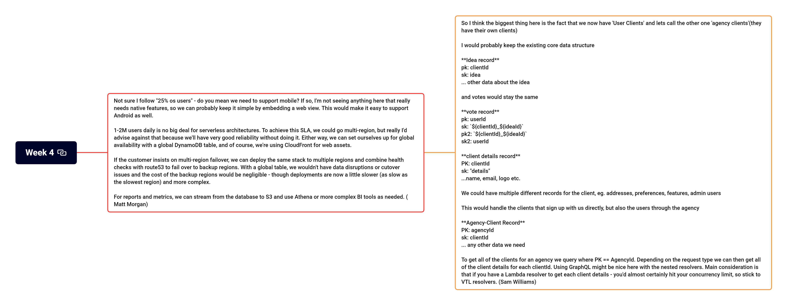

# Week 4

## :link: Thread

[LinkedIn thread](https://www.linkedin.com/posts/pawelpiwosz_devops-cloud-aws-activity-7022996829965332480-LPku)

## :page_with_curl: Requirements

* First, we need to be able to separate data belongs to different Clients.
* Clients also want to separate data per voting
* Clients want to have dashboards with statistics (logged users, votes sent in time) and performance (how many votes per second, latency, errors, transaction execution time, etc)
* We also have one new Client, who delivers his platform to his customers. The Client is "MyGreatWebpage.com". They provide a simple engine to create landing pages, where owners of these pages can add some votings. We know only this:
  * Currently they have 100k hosted pages of their users
  * Traffic is arround 1M of visits per day (cumulated for the whole platform)
  * 25% os users are interested in voting function
  * They assume 50% growth in voting plugin implementation amog their users, and 65 percent of growth in next year
  * The service must be provided without any downtime, with 99.999% SLA.
  * They need to report to their bosses and founders, therefore they expect the automated report build monthly (with number of users, votes, etc, performance metrics, and costs of the service, splitted per their user)
  * Regarding last position - they want to identify votings per user (as this will be the paid option on their service). They can send us some UserID of the user. The granularity here is per user (not per voting).

## :bookmark_tabs: Previous requirements

1. Client has to be logged in to vote
2. Client can vote only once
3. Client receives a confirmation of the action (or info that something went wrong)
4. Client can create many votings (for example 1 or 4 or... 15)
5. Some of these votings are tagged as free, some as paid with credit payments (for Frontend, this information must be visible in the voting tile, please reffer to my awesome graphics below :D )
6. User can decide if he wants to see paid votings
7. Users can buy credits using third party vendors (PayPal, credit cards). Our Client doesn't want to incorporate third party solution to have as less responsibilities in payments area as possible
8. The credits user has are visible for him on the "my profile" page
9. Each vote in paid voting costs one credit
10. Scheduled votings - start and end time of voting.
11. Client wants to send a few types of messages to people - reminders, updates, alerts. All these messages must be pushed to the app (not email, or any other channel)

## :thought_balloon: Discussions

Here are the threads, started by:

* [Matt Morgan](discussions/MattMorgan.md)
* [Sam Williams](discussions/SamWilliams.md)

## :triangular_ruler: Architecture

You find all diagrams in *architecture* directory. It contains all diagrams created by Authors or me.

## :hammer: Services

This list contains **all** services mentioned by Authors. This time, the list covers also services from previous weeks.

* [Cognito](https://aws.amazon.com/cognito/)
* [S3 bucket](https://aws.amazon.com/s3/)
* [CloudFront](https://aws.amazon.com/cloudfront/)
* [Lambda](https://aws.amazon.com/lambda/)
* [Step Functions](https://aws.amazon.com/step-functions/)
* [Appsync](https://aws.amazon.com/appsync/)
* [API Gateway](https://aws.amazon.com/api-gateway/)
* [DynamoDB](https://aws.amazon.com/dynamodb/)
* [SQS](https://aws.amazon.com/sqs/)
* [SNS](https://aws.amazon.com/sns/)
* [Route53](https://aws.amazon.com/route53/)
* [ElastiCache](https://aws.amazon.com/elasticache/)
* [Amplify](https://aws.amazon.com/amplify/)
* [WAF](https://aws.amazon.com/waf/)
* [Timestream](https://aws.amazon.com/timestream/)
* [EventBridge](https://aws.amazon.com/eventbridge/)
* [Athena](https://aws.amazon.com/athena/)

Third party services

* [Stripe](https://stripe.com/)
* [PayPal](https://www.paypal.com/)

## :bulb: Mindmap

## :chart_with_upwards_trend: Statistics

A little statistics about the thread. The final data here is updated around the moment of publishing the task of the new week.

| Key                             | Value |
| :------------------------------ | :---- |
| Reactions                       | 6     |
| Impressions                     | 1315  |
| Comments (excluding my own :) ) | 4     |
| Reposts                         | 2     |
| Engaged                         | 2     |

## :coffee: Comments over coffee (or something else :smile: )

:one: We have disagreement from the Team to requeirements about SLA! Cool!  
:two: This is something what we treat too lightly sometimes. We have to remember, that the SLA of the service we provide is in consequence taken from all services we use.  
:three: Not many entries this time  
:four: I have a feeling that this week could be too tough.
