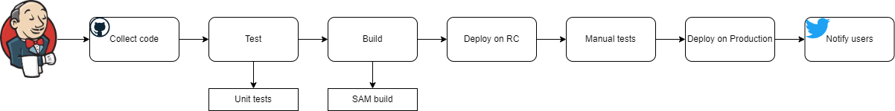
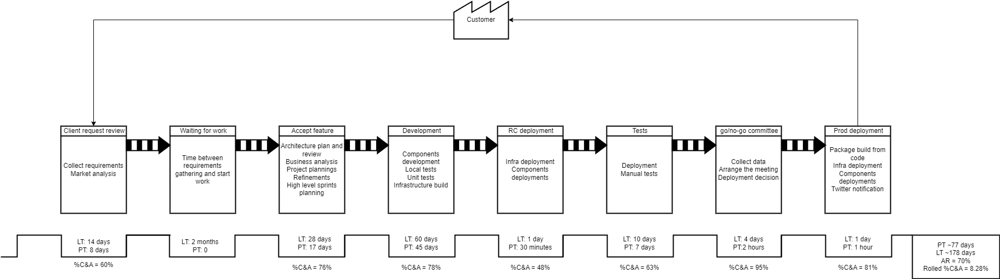

# Week 7

## :link: Thread

[LinkedIn thread](https://www.linkedin.com/posts/pawelpiwosz_github-pawelpiwoszthegame-serverless-activity-7030699574428057601-1xp6)

## :question: The poll

This week is different. In fact, you selected the challenge but... I added something from myself :smile:

So, we had a pool. And here are the results

| Option | Votes |
|:-------|:-----:|
| Go deeper into security | 7 |
| Another challenge for architecture | 4 |
| Simple Value Stream Map task | 4 |
| **Challenge CTO's CI/CD design** | **9** |

The winner is obvious, however, I had a *brilliant* idea and we will have quite interesting challenge this week!

## :page_with_curl: Requirements

Ok, so, our challenge this week contains two elements. One "obligatory" and one optional.

### :boom: Obligatory

> **Note**
> Some background of the CTO. This is his first project in Serverless technology. He has almost 30 years of experience in IT (well, not much more than me, coincidence? :smirk: ) He came from very huge and procedure-oriented company. His team consist of developers, testers, architects, but no one knows DevOps, so he took it. And, well... he is quite sure of his skills ;P

Here is the diagram of CI/CD process. This is designed by CTO and the diagram is created during quality assessment.

Issues found during assessment:

* pipeline fails very often
* during the manual test pipeline is "frozen" and stays in this state for long time
* Team is not able to get any valueable metrics from the pipeline
* Team has a "feeling" that pipeline is not valuable at all and disconnected from the development

Our task is to:

* propose toolset which can be better for serverless workload (if applicable)
* improve the steps of the pipeline (redesign from scratch if you wish)

### :sparkles: Optional

Now the fun begins :smile:

Obligatory task contains some part of work done during assesment. But something more was done. The assessment team prepared the Current state of value stream.

> **Note**
> Well, I had troubles with this part. So, I came to conclusion I create very simplified value stream map, to engage as many of you as possible.

Below is the picture of captured current value stream. On this map you can see identified steps with data about them.

Legend:

* PT - Process Time - actual work time.
* LT - Lead time - period of time in which the work is in the stage
* AR - Activity Ratio - for how long the work is idle.
* %C&A - Complete and accurate. This vale describes percentage of work which is done properly. For example, if 30% of work which is pushed to phase B need to be returned back to phase A (because of issues, errors, bugs, etc), it means that your Activity Ration is equal to 70%. So, almost 1/3 of your work needs some kind of rework.
* Rolled %C&A - accuracy of the whole process. AS you can see, it isn't... good.

Ok, so we know what is the current state. Your task is create improvements. Well, let it be the ideal state. Base on CI/CD from obligatory part and your experience (please, remember, this is the game, we don't want to be strict and stiff :smile:), please find a way how to make this process nice and smooth.

## :bookmark_tabs: Previous requirements

1. Client has to be logged in to vote
2. Client can vote only once
3. Client receives a confirmation of the action (or info that something went wrong)
4. Client can create many votings (for example 1 or 4 or... 15)
5. Some of these votings are tagged as free, some as paid with credit payments (for Frontend, this information must be visible in the voting tile, please reffer to my awesome graphics below :D )
6. User can decide if he wants to see paid votings
7. Users can buy credits using third party vendors (PayPal, credit cards). Our Client doesn't want to incorporate third party solution to have as less responsibilities in payments area as possible
8. The credits user has are visible for him on the "my profile" page
9. Each vote in paid voting costs one credit
10. Scheduled votings - start and end time of voting.
11. Client wants to send a few types of messages to people - reminders, updates, alerts. All these messages must be pushed to the app (not email, or any other channel)
12. Sseparation of data belongs to different Clients.
13. Clients also want to separate data per voting
14. Clients want to have dashboards with statistics (logged users, votes sent in time) and performance (how many votes per second, latency, errors, transaction execution time, etc)
15. New Client has expectations regarding the performance - details in repo.

## :thought_balloon: Discussions

Here are the threads, started by:

TBD

## :triangular_ruler: Architecture

You find all diagrams in *architecture* directory. It contains all diagrams created by Authors or me.

## :hammer: Services

This list contains **all** services mentioned by Authors. This time, the list covers also services from previous weeks.

* [Cognito](https://aws.amazon.com/cognito/)
* [S3 bucket](https://aws.amazon.com/s3/)
* [CloudFront](https://aws.amazon.com/cloudfront/)
* [Lambda](https://aws.amazon.com/lambda/)
* [Step Functions](https://aws.amazon.com/step-functions/)
* [Appsync](https://aws.amazon.com/appsync/)
* [API Gateway](https://aws.amazon.com/api-gateway/)
* [DynamoDB](https://aws.amazon.com/dynamodb/)
* [SQS](https://aws.amazon.com/sqs/)
* [SNS](https://aws.amazon.com/sns/)
* [Route53](https://aws.amazon.com/route53/)
* [ElastiCache](https://aws.amazon.com/elasticache/)
* [Amplify](https://aws.amazon.com/amplify/)
* [WAF](https://aws.amazon.com/waf/)
* [Timestream](https://aws.amazon.com/timestream/)
* [EventBridge](https://aws.amazon.com/eventbridge/)
* [Athena](https://aws.amazon.com/athena/)
* [CloudFormation](https://aws.amazon.com/cloudformation/)
* [CDK](https://aws.amazon.com/cdk/)
* [IAM](https://aws.amazon.com/iam/)
* [CodeCommit](https://aws.amazon.com/codecommit/)
* [CodeBuild](https://aws.amazon.com/codebuild/)
* [CodeDeploy](https://aws.amazon.com/codedeploy/)
* [IAM Identity Center (formely SSO)](https://aws.amazon.com/iam/identity-center/)
* 

Third party services

* [Stripe](https://stripe.com/)
* [PayPal](https://www.paypal.com/)
* GitHub Actions
* Gitlab
* Slack

## :bulb: Mindmap

TBD

## :chart_with_upwards_trend: Statistics

TBD

## :coffee: Comments over coffee (or something else :smile: )

TBD

## The end

And the game ended quietly :smile:
