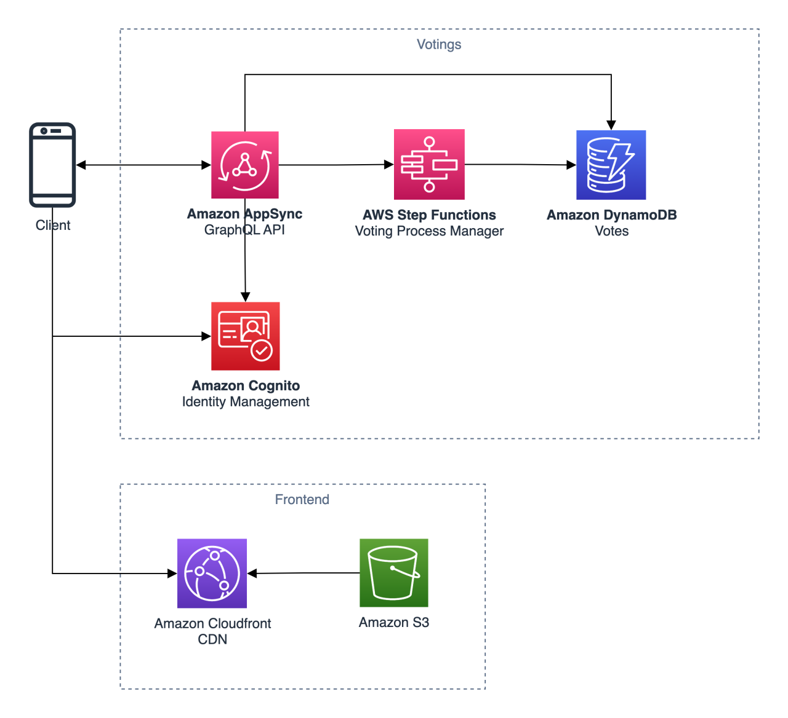

# Christian Bonzelet

My first project using AWS was a Voting System for a big live show of a broadcaster here in Germany. It was the time where serverless was not really a thing (2013). It is really cool to see how the amount of possible options increased during that time. The system we had to built needed to be able to scale very fast. Combined with the fact that votings had to be processed reliable and with low latency as the timeframe where the voting was open was very short.  

Based on the requirements given, the focus on my take here was not on performance but more on a reliable processing of votings. See further explanations in the following comment.

Christian's diagram

The frontend is hosted as a static webpage on S3 and delivered globally via Amazon Cloudfront.

**Votings are processed in the backend using AWS Step Functions. Why did I choose Step Functions?**
AWS Step Functions gives you the option to rerun failed executions with increases the reliability of the voting system. It also gives you some nice observability features out of the box to get feedback about the health of your vote processing. The only concern I have here is the Execution History quota of 25000. It might be worth to put a queue in between as soon as the system needs to scale more.

**Why not Amazon SNS for user notifications?**
Amazon SNS has some hard limits that you have to know and keep in mind when integrating with high scaling user facing applications. It is an awesome service but as the requirements do not reveal how the notification should be sent, I decided to use the feature of bidirectional communication using AppSync connected to the DynamoDb to send a notification based on the voting processing state directly in the client. The client is subscribed to state changes in Amazon DynamoDB and can trigger notifications based on those changes.
