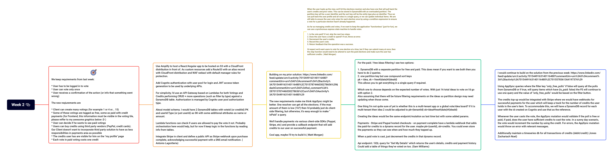

# Week 2

## :link: Thread

[LinkedIn thread](https://www.linkedin.com/posts/pawelpiwosz_aws-people-architecture-activity-7017910225949093888-I4y6)

## :page_with_curl: Requirements

We keep requirements from last week:

* User has to be logged in to vote
* User can vote only once
* User receives a confirmation of the action (or info that something went wrong)

The new reqiurements are

* Client can create many votings (for example 1 or 4 or... 15)
* Some of these votings are tagged as free, some as paid with credit payments (for Frontend, this information must be visible in the voting tile, please reffer to my awesome graphics below :D )
* User can decide if he wants to see paid votings
* Users can buy credits using third party vendors (PayPal, credit cards). Our Client doesn't want to incorporate third party solution to have as less responsibilities in payments area as possible
* The credits user has are visible for him on the "my profile" page
* Each vote in paid voting costs one credit

### Updates to requirements

After publication some clarification questions appeared. That's good :smile: However, please remember the one of rules: `if something is not said, you are free to propose your option`.

### Update #1

* After consideration, our Client said that third party integrations are ok.
* Client is not sure about number of concurrent votings. But they gave us  an information that 16 concurrent votings is a maximum. At least for now.

## :thought_balloon: Discussions

Here are the threads, started by:

* [Antonio Lagrotteria](discussions/AntonioLagrotteria.md)
* [Sam Williams](discussions/SamWilliams.md)
* [Jones Zachariah Noel](discussions/JonesZachariahNoel.md)
* [Matt Morgan](discussions/MattMorgan.md)

## :triangular_ruler: Architecture

You find all diagrams in *architecture* directory. It contains all diagrams created by Authors or me.

## :hammer: Services

This list contains **all** services mentioned by Authors. This time, the list covers also services from previous week.

* [Cognito](https://aws.amazon.com/cognito/)
* [S3 bucket](https://aws.amazon.com/s3/)
* [CloudFront](https://aws.amazon.com/cloudfront/)
* [Lambda](https://aws.amazon.com/lambda/)
* [Step Functions](https://aws.amazon.com/step-functions/)
* [Appsync](https://aws.amazon.com/appsync/)
* [API Gateway](https://aws.amazon.com/api-gateway/)
* [DynamoDB](https://aws.amazon.com/dynamodb/)
* [SQS](https://aws.amazon.com/sqs/)
* [SNS](https://aws.amazon.com/sns/)
* [Route53](https://aws.amazon.com/route53/)
* [ElastiCache](https://aws.amazon.com/elasticache/)
* [Amplify](https://aws.amazon.com/amplify/)
* [WAF](https://aws.amazon.com/waf/)
* [Timestream](https://aws.amazon.com/timestream/)

Third party services

* [Stripe](https://stripe.com/)
* [PayPal](https://www.paypal.com/)

## :bulb: Mindmap

## :chart_with_upwards_trend: Statistics

A little statistics about the thread. The final data here is updated around the moment of publishing the task of the new week.

| Key                             | Value |
| :------------------------------ | :---- |
| Reactions                       | 15    |
| Impressions                     | 3558  |
| Comments (excluding my own :) ) | 11    |
| Reposts                         | 0 :(  |
| Engaged                         | 7     |

## :coffee: Comments over coffee (or something else :smile: )

:one: Looks like this week wasn't that challenging. The solutions grew, obviously, contains new services, also obviously. Although three new AWS services landed on the services list, no thing very complicated happened. Of course, on the code level the changes will be wider.

:two: I will be very happy to have more Players, please share, invite people from your networks :)

:three: I am kindly asking about it, as I plan to do more "seasons" :smile:

:four: Small spoiler. We will touch other topics than design of infrastructure soon. Stay tuned! :smile:

:five: No, these thoughs doesn't have any specific order, except how they came to my mind :smirk:

:six: If anyone has an advice how to reach more people, I'll be more than happy to listen!
